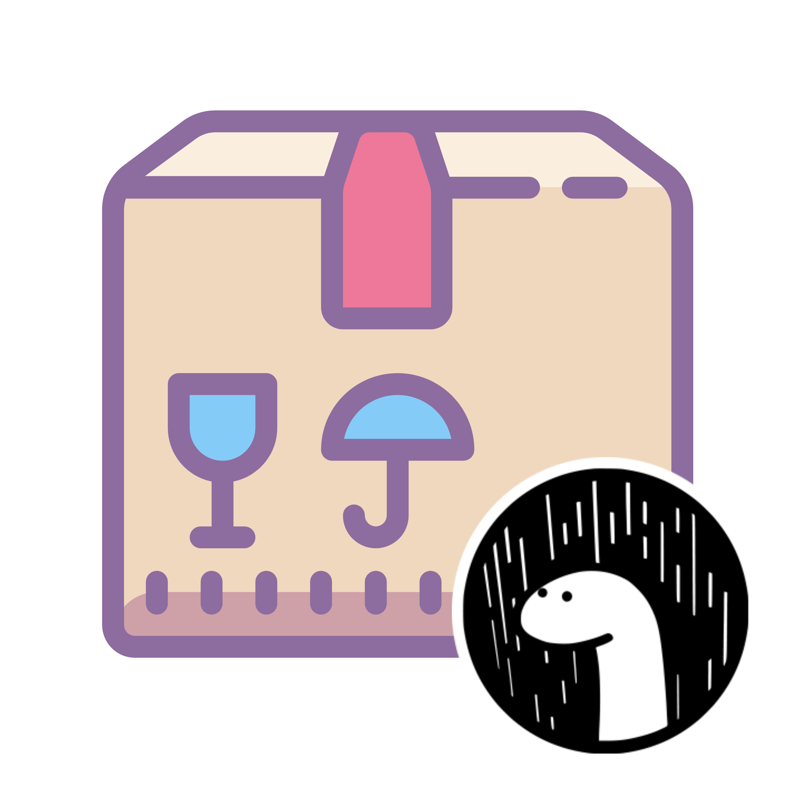

    
    <h1>Deno modules</h1>
    

        <b>A complete list of all the Deno modules I've made / ported</b>
    

    

        
        
        
        
        
        
    

     
     
     

# Table of Contents

- Written from scratch
    - [ngrok](#ngrok)
    - [hcload](#hcload)
- Rewrites
    - [retried](#retried)
- Ports
    - [pQueue](#pQueue)
    - [pRetried](#pRetried)
    - [pTimeout](#pTimeout)
    - [Finity](#Finity)
- Repacks
    - [ee-ts](#ee-ts)

# Written from Scratch

## ngrok

<b><a href="https://github.com/KhushrajRathod/ngrok">View on GitHub</a></b> -- <b><a href="https://deno.land/x/ngrok">View on deno.land</a></b>

- Description: Expose your localhost to the web. Ultra-simple deno wrapper for ngrok

## hcload

<b><a href="https://github.com/KhushrajRathod/hcload">View on GitHub</a></b> -- <b><a href="https://deno.land/x/hcload">View on deno.land</a></b>

- Description: Easily upload files to the [Hack club](https://hackclub.com) CDN

# Rewrites

## retried

- Description: Abstraction for exponential and custom retry strategies for failed operations. 
- Original module: [retry](https://www.npmjs.com/package/retry)
- Changes: Deno, TypeScript, ES6+

# Ports

## pQueue

<b><a href="https://github.com/KhushrajRathod/pQueue">View on GitHub</a></b> -- <b><a href="https://deno.land/x/p_queue">View on deno.land</a></b>

- Description: Promise queue with concurrency control. Useful for rate-limiting async (or sync) operations. For example, when interacting with a REST API or when doing CPU/memory intensive tasks.
- Original module: [p-queue](https://www.npmjs.com/package/p-queue)

## pRetried

<b><a href="https://github.com/KhushrajRathod/pRetried">View on GitHub</a></b> -- <b><a href="https://deno.land/x/p_retried">View on deno.land</a></b>

- Description: Retry a promise-returning or async function. Abstraction for exponential and custom retry strategies for failed operations
- Original module: [p-retry](https://www.npmjs.com/package/p-retry)

## pTimeout

<b><a href="https://github.com/KhushrajRathod/pTimeout">View on GitHub</a></b> -- <b><a href="https://deno.land/x/p_timeout">View on deno.land</a></b>

- Description: Timeout a promise after a specified amount of time
- Original module: [p-timeout](https://www.npmjs.com/package/p-timeout)

## Finity

<b><a href="https://github.com/KhushrajRathod/Finity">View on GitHub</a></b> -- <b><a href="https://deno.land/x/finity">View on deno.land</a></b>

- Description: A finite state machine library with a friendly configuration DSL.
- Original module: [finity](https://www.npmjs.com/package/finity)

# Repacks

## ee-ts

<b><a href="https://github.com/KhushrajRathod/ee-ts">View on GitHub</a></b> -- <b><a href="https://deno.land/x/ee_ts">View on deno.land</a></b>

- Description: Type-safe event emitters
- Original module: [ee-ts](https://www.npmjs.com/package/ee-ts)